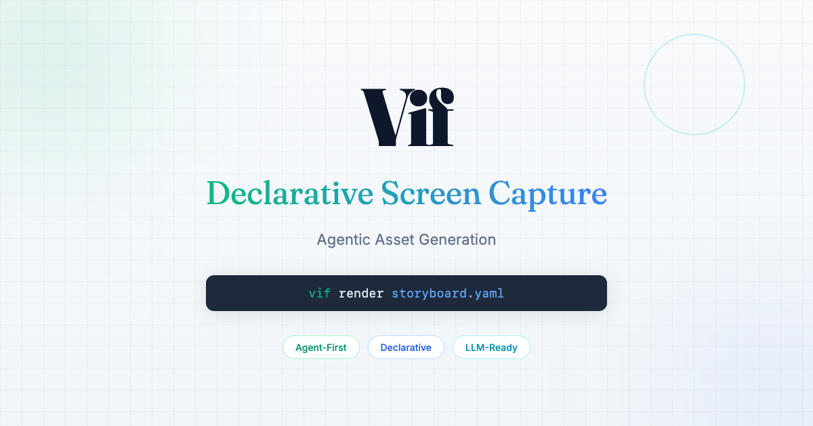

# Vif

**Declarative Screen Capture** — Agentic asset generation for macOS.



Screen capture built for AI agents and LLMs. Declarative storyboards, CLI-native, everything is a file.

## Features

- **Agent-First**: Designed for LLM tool use with predictable, parseable output
- **Declarative Scenes**: Define demo sequences in YAML with the Scene DSL
- **Agentic Control**: `vif-ctl` CLI and MCP server for AI agent integration
- **Live Control Panel**: Expandable layer viewer showing active stage elements
- **Headless Mode**: Full immersive recording without UI overlay
- **Window Discovery**: Find windows by app name with precise window IDs
- **Screenshot Capture**: Capture windows, regions, or fullscreen
- **Video Recording**: Record screen with optional audio
- **Video Processing**: Convert, optimize, and create GIFs (requires ffmpeg)

## Installation

```bash
pnpm install @arach/vif
```

Or globally:

```bash
pnpm install -g @arach/vif
```

## Quick Start

```bash
# Check system capabilities
vif check

# Screenshot fullscreen
vif shot screenshot.png

# Screenshot an app window
vif shot --app Safari safari.png

# Record video (Ctrl+C to stop)
vif record demo.mp4

# Render a storyboard
vif render storyboard.yaml
```

## Agentic Control

Control vif programmatically for AI agent integration:

```bash
# Start the automation server
vif serve

# Control via vif-ctl CLI
vif-ctl backdrop on                    # Show dark backdrop
vif-ctl cursor show                    # Show animated cursor
vif-ctl cursor move 500 300 0.5        # Move cursor with animation
vif-ctl label show "Recording demo"    # Show teleprompter label
vif-ctl stage clear                    # Clear all overlays

# Headless mode (hide control panel for immersive recording)
vif-ctl panel headless on              # Enable headless mode
vif-ctl panel headless off             # Disable headless mode
```

**Keyboard Shortcuts:**
- `Escape` — Exit headless mode + clear all overlays
- `⌃⌥⌘V` — Toggle headless mode
- `⇧⌘R` — Stop recording
- `⇧⌘X` — Clear stage

**MCP Server** for Claude and AI agents:
```bash
vif-mcp  # Start MCP server for native tool access
```

## Storyboards

Define video sequences declaratively in YAML:

```yaml
name: product-demo
output: demo.mp4
audio:
  file: music.mp3
  volume: 0.7
  fadeOut: 2
sequence:
  - source: intro.mp4
    duration: 3
  - source: features.mp4
    transition: crossfade
```

Then render:

```bash
vif render storyboard.yaml
```

## CLI Usage

```bash
# List all visible windows
vif windows

# Screenshot fullscreen
vif shot screenshot.png

# Screenshot an app window
vif shot --app Safari safari.png

# Screenshot by window ID
vif shot --window 12345 window.png

# Record video (Ctrl+C to stop)
vif record demo.mp4

# Record for specific duration
vif record --duration 10 demo.mp4

# Convert video to GIF
vif gif demo.mp4 demo.gif --width 600 --fps 15

# Optimize video for web
vif optimize raw.mov web-ready.mp4 --width 1280

# Take management
vif take screenshot --name hero-shot
vif take list
```

## Library Usage

```typescript
import {
  getWindows,
  screenshot,
  screenshotApp,
  startRecording,
  recordVideo,
  convertVideo,
  videoToGif,
  activateApp
} from '@arach/vif';

// List windows
const windows = getWindows();
console.log(windows);

// Filter by app
const safariWindows = getWindows('Safari');

// Screenshot an app
screenshotApp('Safari', './safari.png');

// Screenshot by window ID
screenshot({
  output: './window.png',
  windowId: 12345,
  noShadow: true
});

// Record video for 10 seconds
await recordVideo({
  output: './demo.mp4',
  duration: 10,
  audio: false
});

// Start recording and stop manually
const recording = startRecording({ output: './demo.mp4' });
// ... do stuff ...
await recording.stop();

// Convert to GIF
videoToGif('./demo.mp4', './demo.gif', {
  width: 480,
  fps: 10
});

// Optimize for web
convertVideo({
  input: './raw.mov',
  output: './web.mp4',
  width: 1280,
  crf: 23,
  noAudio: true
});
```

## Requirements

- macOS (uses `screencapture` which is built-in)
- Node.js 18+
- Swift (for window discovery - comes with Xcode Command Line Tools)
- ffmpeg (optional, for video processing): `brew install ffmpeg`

## API Reference

### Window Functions

- `getWindows(appName?)` - Get all visible windows, optionally filtered by app
- `findWindow(appName)` - Find first window matching app name
- `activateApp(appName)` - Bring an app to the front

### Screenshot Functions

- `screenshot(options)` - Capture screenshot with full options
- `screenshotApp(appName, output, options?)` - Screenshot an app window
- `screenshotFullscreen(output)` - Capture entire screen
- `quickShot(prefix?)` - Quick screenshot with auto filename

### Video Functions

- `startRecording(options)` - Start recording, returns handle to stop
- `recordVideo(options)` - Record for specific duration

### Processing Functions

- `convertVideo(options)` - Convert/process video
- `optimizeForWeb(input, output, maxWidth?)` - Optimize for web delivery
- `videoToGif(input, output, options?)` - Create GIF from video
- `hasFFmpeg()` - Check if ffmpeg is available

## Built with Vif

- [Speakeasy](https://speakeasy.arach.dev) - Text-to-speech library landing page

## License

MIT
